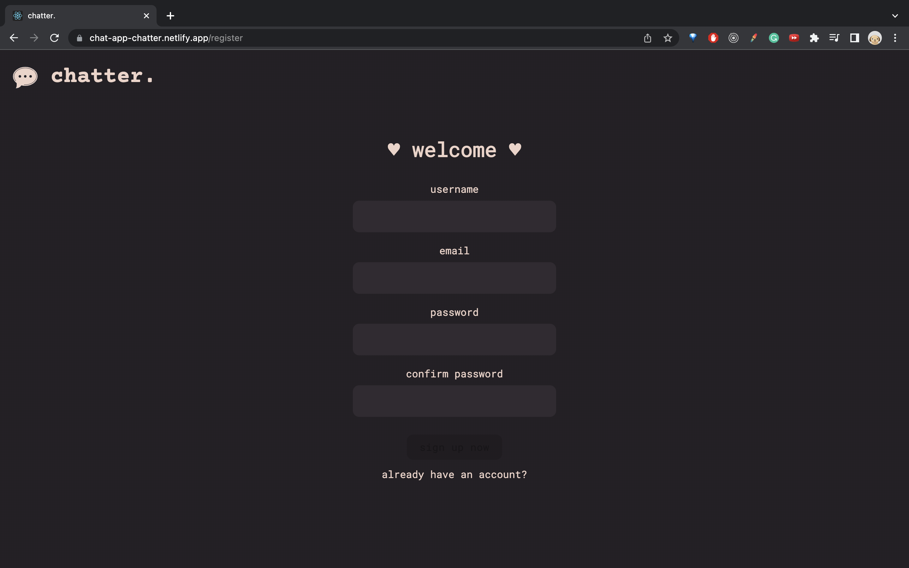
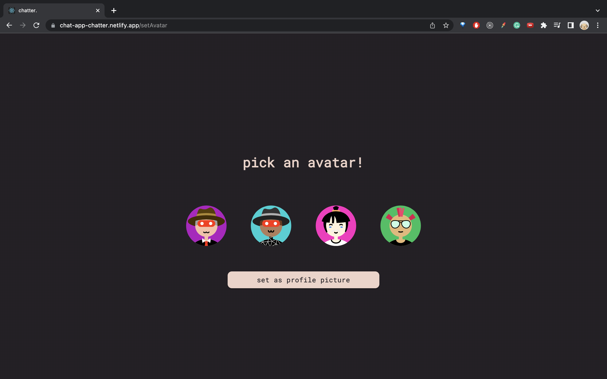
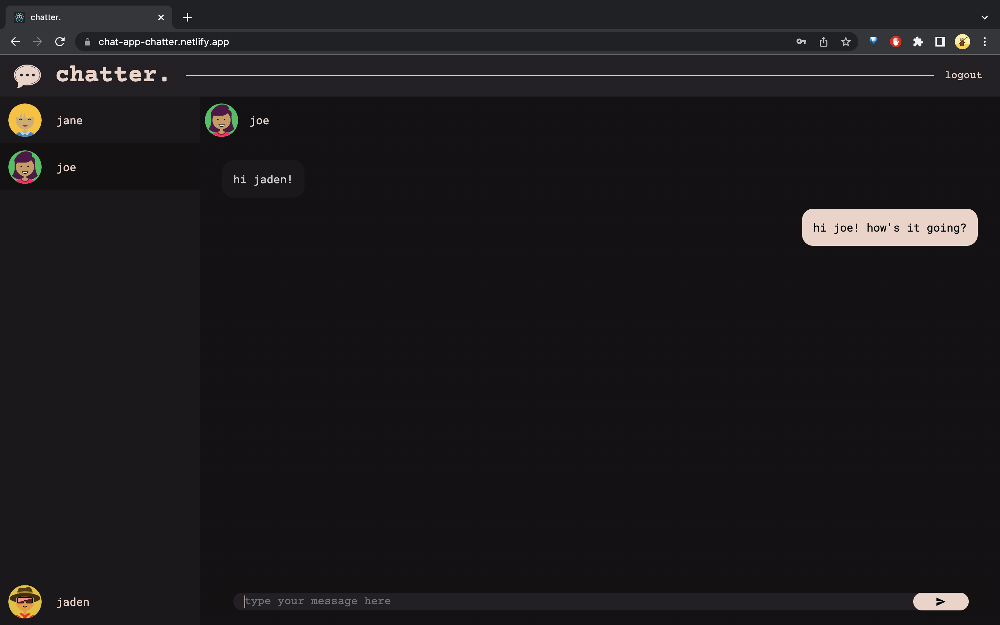

# chatter.

A user-to-user chat application built using MongoDB, Express, Node.js and React. Socket.io implementation allows for real-time communication.

You can the find backend repository <a href="https://github.com/jasleen-k/chat-app-backend" title="backend">
here</a> and it is hosted on <a href="https://chat-app-chatter.herokuapp.com/" title="heroku">
heroku.</a>

## Demo

## Try It Yourself

Make a new account or use one we've already made. 

email: test@gmail.com

password: test12345 

